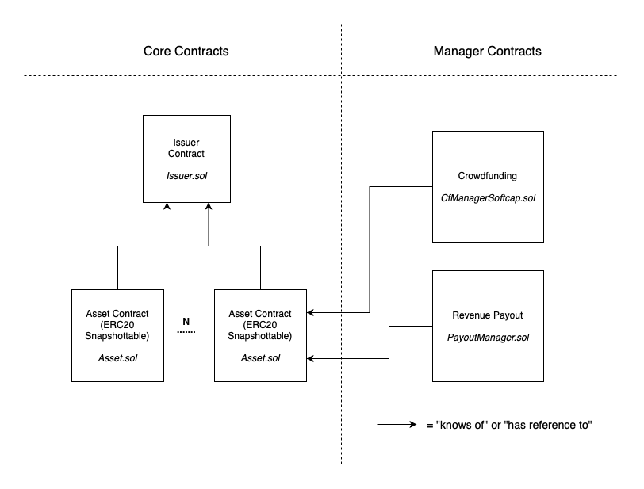

# Tokenizer Contracts Prototype

AMPnet Crowdfunding Platform v1.0 written in Solidity language.

## Contract types

There are 4 different contract implementations:
- Issuer.sol
- Asset.sol
- CfManagerSoftcap.sol
- PayoutManager.sol

Dynamics between these contracts is shown in the image below and then explained in the detail in the next section.

## Features

- <b>Issuer creation (Issuer.sol)</b>
    - Issuer is an organizational unit representing a collection of multiple assets. Each issuer is described by one <i>Issuer.sol</i> contract instance deployed on the chain.
    - Issuer has only one owner (of type <i>address</i>)
    - Each asset belongs to one issuer
    - Think of Issuer being a company owning multiple assets in the real world, and each of those assets has been tokenized and mapped to the ERC20 token
    - Issuer holds the mapping of the whitelisted wallets. This is important if the Asset token is only allowed to be transferred between whitelisted/approved wallets. This is also important if the Asset tokens are being sold at the crowdfunding campaign where only whitelisted investors are allowed to invest.
    - Issuer can be configured with following parameters:
        - stablecoin address -> address of the stablecoin to be accepted for the investments (if one the Asset tokens created for the Issuer is sold at the crowdfunding campaign)
        - wallet approver address -> address with the rights to whitelist or suspend wallets. Can be configured to one of AMPnet addresses to automate wallet whitelisting after users have successfully finished the KYC process for example. Issuer creators can provide other addresses here if they want to have a full control and handle user whitelisting by themselves.
        - issuer info -> info ipfs hash describing one issuer (updatable by the owner)
- <b>Asset creation (Asset.sol)</b>
    - Asset is an [ERC20Snapshot contract](https://docs.openzeppelin.com/contracts/4.x/api/token/erc20#ERC20Snapshot). Snapshottable to support rewarding token holders at any point in time regardless of the fact that token shareholder structure might change later on.
    - Each issuer is described by one <i>Asset.sol</i> contract instance deployed on the chain.
    - Asset is of fixed supply.
    - No one can create or destroy supply.
    - Once the token has been created, the owner/creator is holding the 100% of the supply. Owner can then manage tokens using one of the Manager contracts.
    - Asset can be configured with the following parameters during the creation:
        - issuer address -> address of the issuer whose member this Asset will become
        - initial token supply -> number of the tokens to be created. Not changeable afterwards.
        - asset info -> name, symbol, info ipfs hash (updatable by the owner)
        - whitelist required for the token transfer -> flag to limit the asset transfers. If set to <i>true</i> only the addresses whitelisted by the superior issuer can. If set to false, asset will work as any other ERC20 token, freely tradable between any two addresses.
- <b>Crowdfunding Campaigns (CfManagerSoftcap.sol)</b>
    - Crowdfunding Campaigns are created by deploying <i>CfManagerSoftcap.sol</i> contract and transferring any amount of the Asset tokens to the deployed contract address. CfManagerSoftcap then handles the investors, and distributes tokens based on the investment amount.
    - Each crowdfunding campaign is described by one <i>CfManagerSoftcap.sol</i> contract instance deployed on the chain.
    - Crowdfunding campaign can be configured with following parameters:
        - asset address -> address of the asset whose tokens will be sold during the crowdfunding campaign
        - token price -> price per token expressed as integer with 4 decimal places precision encoded in the value. For example, value 10000 represents the price of $1 (dollar if USDC token is configured for the Issuer as an accepted payment method, but can be any other coin). The value 123456 representes the price of $12.3456 per token.
        - soft cap -> minimum amount of funds to be raised for the campaign to be considered successful. Campaign owners can finalize campaign only if this amount has been reached.
        - whitelist required flag -> if set to <i>true</i>, only wallets whitelisted by the superior issuer can invest and be part of the crowdfunding campaign. Value <i>false</i> will allow anyone to invest.
    - After crowdfunding campaign has been created (contract deployed), Asset token owner must simply call the ERC20 transfer and send any amount of the tokens he is willing to sell to the address of the newly created CrowdfundingManager contract instance. There is an optional step before the token transfer, Issuer owner has to whitelist the CrowdfundingManager contract but this is only the case if the Asset token has been configured to only be transferable between whitelisted wallets.
    - Asset owner can't withdraw tokens sent to the crowdfunding campaign, but can send more of his tokens to the same campaing to increase the amount of the tokens to be sold, if he wishes to do so.
    - Investors can invest in the active crowdfunding campaign by executing the two steps:
        1. call <b>approve(investmentAmount)</b> function to approve CrowdfundingManager contract to spend their funds. Approve function is called on the stablecoin contract defined as the accepted payment method by the Asset token's belonging Issuer.
        2. call <b>invest(investmentAmount)</b> which will result in CrowdfundingManager contract taking investor's investmentAmount funds, and storing investment details for the investor so he can claim bought tokens if the campaign gets finalized successfully by the campaign owner.
    - Investors are allowed to cancel their investment only if the CrowdfundingManager contract was not finalized by the campaign creator (see below). Investors can cancel the investment by calling the <b>cancelInvestment()</b> function which will in turn reset their claimable Asset tokens amount and refund the stablecoin they invested back to their wallets.  
    - CrowdfundingManager owner must eventually call one of two functions on the CrowdfundingManager contract:
        - <b>finalize()</b> -> only callable by the campaign creator if the campaign has reached the soft cap. This will close the campaign, so new investors can no longer invest, and existing investors can finally claim their tokens by calling the <b>claim()</b> function. <b>finalize()</b> will also transfer all of the funds raised from the crowdfunding manager contract to the campaign owner's wallet, and transfer all of the remaining (unsold) asset tokens back to the owner's wallet.
        - <b>cancelCampaign()</b> -> only callable by the campaign creator if the campaign hasn't been finalized before. By canceling the campaign, all of the Asset tokens to be sold are returned to the campaign owner's wallet, and new investments are no longer possible. Existing investors can cancel their investments by calling the <b>cancelInvestment()</b> function. Investment cancellation can be triggered by the investor at all times but not if the camapign has been finalized.
- <b>Asset Token Holder Rewards (PayoutManager.sol)</b>
    - Asset is actaully an ERC20Snapshot instance with the possibility of taking the token ownership structure snapshots at any point in time. Every snapshot taken on the Asset contract will get its unique snapshotID (auto increment integer where first snapshot is assigned with id=1).
    - PayoutManager.sol contract can use the snapshot mechanism for the underlying asset to create and hold stablecoin rewards for Asset token holders at given snapshot ID.
    - To distribute for example some amount of USDC to the Asset token holders proportional to the current Asset ownership structure, one must execute three steps:
        1. deploy PayoutManager.sol for given Asset token
        2. approve the PayoutManager contract instance to spend some amount of USDC from payer's wallet
        3. call the <i>createPayout(amount)</i> function on the Payout Manager which will in turn transfer USDC amount to the payout manager contract and create the snapshot on underlying asset to give rights to all the token holders at that snapshotID to claim their share of the received USDC funds.    
    - Asset token holders with rights to claim rewards at given snapshotID (so all the wallets with >0 asset token amount at that snapshotID moment) can claim the funds by calling the <i>release()</i> function on the payot manager contract

## Crowdfunding Campaign scenarios

Crowdfunding campaign creation includes 4 steps:

1) Asset (ERC20Snapshot) has to be created with fixed supply and address of the belonging Issuer instance. Asset creator must decide on the supply upfront and cannot change it afterwards. Asset creator becomes a 100% holder of this token.

2) Asset creator deploys CfManagerSoftcap.sol by providing the address of previously created token.

3) *Issuer has to whitelist this crowdfunding campaign (issuer owner, asset owner, and cfManager owner can all be the same address). This step can be skipped if the Asset is created as a freely tradable token (see more in features). If asset allows only whitelisted addresses to take part in transfer actions then the CfManager contract also has to be whitelisted by calling the <i>approveCampaign(cfManagerInstanceAddress)</i> function on the Issuer instance.

4) Asset creator transfers amount of tokens he is willing to sell to the address of the CfManager contract created in the step 2.

Different crowdfunding campaign models may be created by providing different constructor parameters for CfManagerSoftcap.sol in the step 2 above.
Some of them are listed here:

-> softCap can be set to 0, so any amount of tokens can be sold before campaing manager chooses to finalize the campaign. This can be useful for example for charity fundraising where any amount of funds collected is useful. The rest of the tokens (unsold ones) are returned to the token owner after campaign finalization.

-> softCap can be set to be equal the total value of tokens being sold, this way the campaign is only successful and can be finalized if all of the tokens are sold.

-> softCap can be set to somewhere between 0 and the total value of the tokens being sold. This way we have a campaign with softCap (predefined param) and hardCap (total value of tokens being sold) params where campaign owner can finalize() the campaign if the funds raised are anywhere between [softCap, hardCap].

-> campaign manager can refill cfManager contract with his remaining tokens if the sale is going good, by simply transferring more tokens to the address of the crowdfunding manager contract

## Factories

Each of the 4 different contracts can and will be deployed by calling its factory contract's <i>create()</i> method. That way, we can have official factory contracts deployed on the chain at known addresses and we can be sure that all the contracts created this way weren't tampered with. Every factory holds addresses of all the instances ever created by calling their <i>create()</i> function. It's easy to check for the contract with address A if it was created by an official factory or not.

List of factory contracts:
- AssetFactory.sol
- IssuerFactory.sol
- CfManagerSoftcapFactory.sol
- PayoutManagerFactory.sol

## Known issues

- PayoutManager must take into account big token holders when distributing revenue based on some given snapshotID. For example, if token owner has sold 80% of the supply, he is still owner of the remaining 20%. But he doesn't want to payout revenue to himself, he only wants to distribute rewards to the investors. One possible solution is to initialize the PayoutManager contract instance with the array of big addresses, and these are then taken into account when calculating the share in <i>release(payoutID)</i> function. This solution will be implemented if no better option is found.

